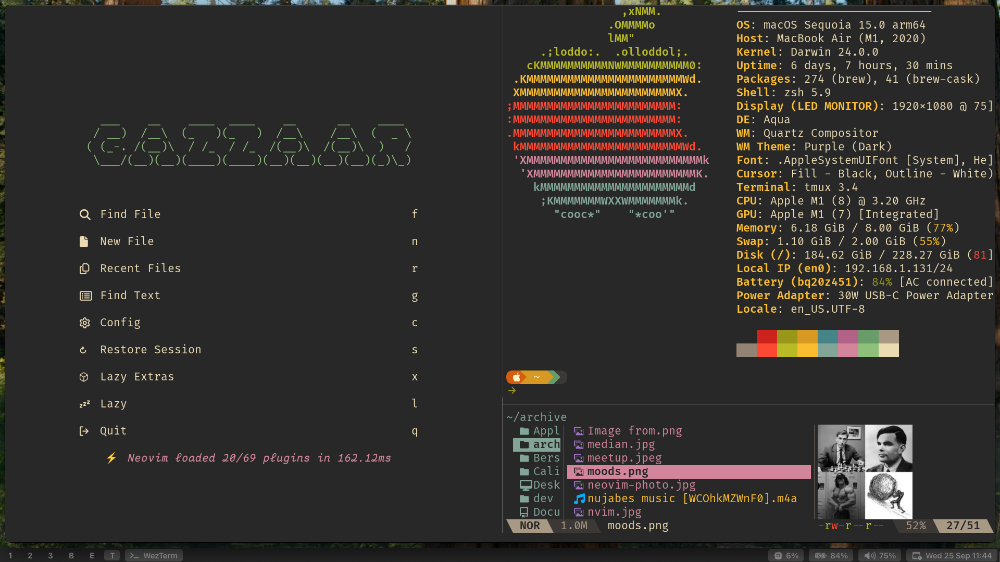

# dotfiles




- My configuration evolves over time, but I always strive for simplicity, especially when it comes to window managers. For that reason, I’ve switched between several window managers, from Rectangle to Yabai to AeroSpace, and finally to Raycast built in window manager.

1- install git:

```
brew install git
```

2- install stow:

```
brew install stow
```

3- clone the repo:

```
git clone git@github.com:gazzaar/dotfiles.git
cd dotfiles
```

4- use stow:

```
stow .
```

5- Install brew formulas and casks

```shell
xargs brew install < ~/.config/brew/Brewfile-formulae
xargs brew install --cask < ~/.config/brew/Brewfile-casks


```
