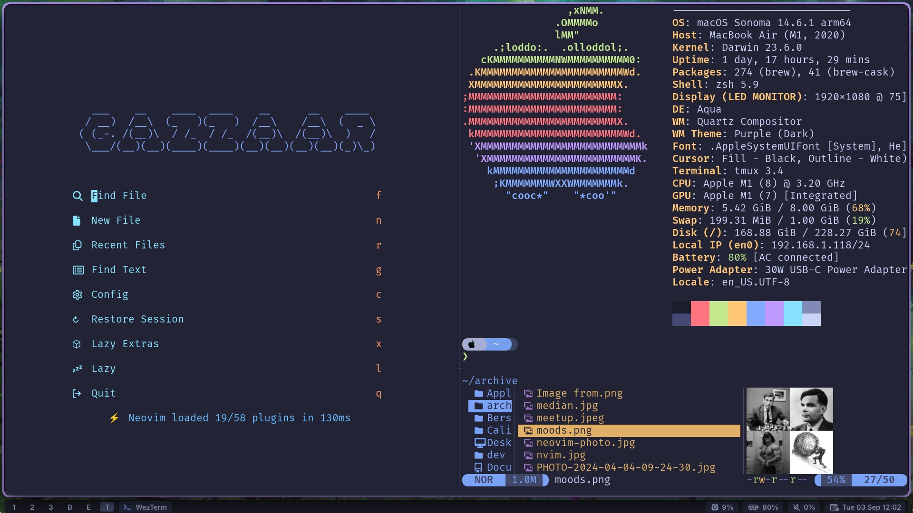

# your dotfiles



1- install git:

```
brew install git
```

2- install stow:

```
brew install stow
```

3- clone the repo:

```
git clone git@github.com:gazzaar/dotfiles.git
cd dotfiles
```

4- use stow:

```
stow .
```

5- Install brew formulas and casks

```shell
xargs brew install < ~/.config/brew/Brewfile-formulae
xargs brew install --cask < ~/.config/brew/Brewfile-casks


```
